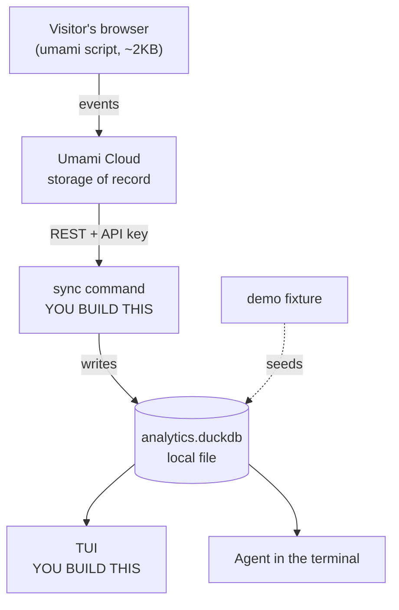

# quinto — Plan

*From "quinto sabor" — the fifth taste. Umami is the fifth taste, and Umami is the data source.*

**Status:** Portfolio project. Validation phase cut. Ready to scope the build.
**Success criterion:** Listed on [awesome-tuis → Dashboards](https://github.com/rothgar/awesome-tuis#dashboards)
**Last updated:** 2026-07-24

---

## What this is

A terminal-native web analytics dashboard for developers who already run agents in their terminal.

**It is a portfolio project, not a product.** Decided 2026-07-24 after establishing that no dogfooding data exists and the target segment is unvalidated. This is an honest reclassification, not a downgrade — it removes weeks of validation work that would not have changed the build.

Jobs (Till's own framing):

- **Functional** — easy-to-read, *local* analytics
- **Emotional** — I can run it from my terminal
- **Social** — a specific aesthetic, for people already running agents in the terminal

---

## Definition of done

**Primary (verifiable):** merged into awesome-tuis → Dashboards.

**Real bar (what actually gets it noticed — the listing follows this, not the reverse):**

- [ ] A demo GIF in the README that works without explanation. This does more for a TUI than any feature.
- [ ] **A seeded demo dataset (`--demo` mode or checked-in fixture).** First-class deliverable, not an afterthought — see "The GIF problem" below.
- [ ] One hook that isn't "another pretty dashboard." Current candidate: the local data file is agent-queryable.
- [ ] Runs on someone else's machine in under a minute — single binary or one install command.
- [ ] A name worth typing.

### The GIF problem

Real traffic is single-digit humans and probably bot-dominated. A stream view showing six rows of `GET / — bot — 200` *is* the demo GIF, and it undersells the tool badly. It also means anyone who installs it sees an empty screen on first run.

So the demo dataset is not optional polish — it's what makes both the GIF and the first-run experience work. Build it early, from realistic shapes, and be transparent in the README that it's seed data.

Getting listed is a forcing function with a clean finish line. It is a weak quality signal on its own — the list accepts most working things. Build for the real bar; the listing follows.

---

## Resolved decisions

Output of a ten-round `/grill-me` session. Settled unless new evidence appears.

| # | Decision | Rationale |
|---|---|---|
| 1 | **"Local" = local database on the user's machine** | Events sync down; queries run against a local DuckDB/SQLite file. Not "UI is local, data lives in someone's cloud." |
| 2 | **Agent-readability is the hook** | A local file can be queried directly by an agent in the terminal — no API, no auth, no rate limits. Human TUI and agent read the same file. This is what separates it from every other dashboard on the list. |
| 3 | **Audience = devs running agents in the terminal** | Till's framing. Sharpest idea in the session. |
| 4 | **TUI, not a VS Code extension** | Editor-agnostic, works over SSH. Not "because people live in VS Code" — that argument points at an extension. |
| 5 | **Scroll depth is cut** | Marketer feature. Needs long content pages and per-page volume. Neither exists. |
| 6 | **Journey maps are cut** | Need ~500+ sessions/week to be anything but noise. Reframed to funnels, then cut too — a funnel at n=8 fails the same test. |
| 7 | **No custom collector, no self-hosting** | Do not build *or run* ingest infrastructure. ~~Cloudflare GraphQL~~ → **Umami Cloud** (see Phase 0 result). |
| 10 | **"Local" = the read path, not the storage of record** | Events live in Umami Cloud; the local DuckDB is a synced copy. TUI and agent read only the local file. |
| 11 | **Name: `quinto`** | From *quinto sabor*, the fifth taste. Umami is the fifth taste and Umami is the source — the reference lands for anyone who knows, and reads as a clean word to anyone who doesn't. Short, typeable, no vowel-dropping. |
| 8 | **Streams, not aggregates** | Aggregates need volume. Streams don't. "Last 50 visits: what they hit, where from, what they did" is honest at any n, trivially a local table, and directly agent-queryable. |
| 9 | **Till is not the target user** | No personal site has meaningful traffic. Dogfooding unavailable — acceptable now that this is a portfolio piece. |

---

## Assumptions (flag if wrong)

- Biggest personal site shows **68 unique visitors / 24h** in Cloudflare, but **245 total requests** — 3.6 req/visitor, flat overnight, peaking at 4 AM. **Likely mostly bots.** Real human sessions probably single digits/day. ← *unverified*
- Low volume is now a **feature constraint, not a blocker** — it forces the stream design, which is the more interesting build anyway.
- ~~Cloudflare's GraphQL API exposes enough per-request detail~~ — **disproven 2026-07-24.** See Phase 0.
- ~~Umami's schema gives per-event rows~~ — **verified 2026-07-25** against the API docs. See Phase 0.
- Umami Cloud's free tier covers this traffic. ← *unverified, pricing page wouldn't scrape; confirm at signup*

---

## Approach

### Phase 0 — RESOLVED 2026-07-24 ❌ Cloudflare cannot be the source

**Question:** can Cloudflare give per-request rows (Decision 8's stream view) on a non-Enterprise plan?

**Answer: no.** Every route to raw request-level data is Enterprise-gated:

| Route | Free | Pro | Business | Enterprise |
|---|---|---|---|---|
| Logpush | ❌ | ❌ | ❌ | ✅ |
| Logpull (legacy) | ❌ | ❌ | ❌ | ✅ |
| Instant Logs | ❌ | ❌ | ❌ | ✅ |

*(Source: Cloudflare Logs docs, availability table, retrieved 2026-07-24.)*

The GraphQL Analytics API is no way around it. Its zone HTTP and RUM nodes are all `…Groups` — aggregated into dimension buckets by design. Raw (non-`Groups`) nodes exist only for a few products, not zone HTTP traffic. **There is no per-visit row anywhere on a free plan.**

Cloudflare Web Analytics *is* free on all plans, but it's the same story: aggregated RUM groups, no session-level stream.

**Consequence:** Decision 7 stands (still not writing a collector), Decision 8 stands (streams are still the right shape), but the **source changes**.

### Source decision — Umami Cloud (hosted). Verified 2026-07-25.

**No self-hosting** — Till's call, 2026-07-25. Umami Cloud, not a box you maintain.

**Verified against the Umami API docs:** `GET /api/websites/:websiteId/sessions/:sessionId/activity` returns per-event rows with exactly the fields the stream view needs —

```json
{
  "createdAt": "2025-10-21T15:00:09Z",
  "urlPath": "/blog",
  "urlQuery": "",
  "referrerDomain": "umami.is",
  "eventId": "…",
  "eventType": 1,
  "eventName": "",
  "visitId": "…"
}
```

Paired with `GET /api/websites/:websiteId/sessions` (session list over a time range), that *is* the stream view, natively. Auth is an API key — see Umami docs `cloud/api-key`.

**Why this over PostHog Cloud:**

- Exact-fit API. PostHog's HogQL is more powerful, but you'd be querying a product-analytics warehouse to render a visit list.
- ~2 KB script, no cookies, no consent banner. PostHog's bundle and consent surface are large for what this needs.
- Matches the segment's aesthetic — lightweight and privacy-first is the same taste that likes TUIs.
- Free tier covers this traffic many times over.

⚠️ **Known limitation — N+1 fetch.** The sync is: list sessions, then one activity call *per session*. Fine at single-digit sessions/day. It would fall over on a busy site, which matters if anyone else ever points this at real traffic. **Check Umami's `cloud/export-data` for a bulk path before writing the sync loop.**

⚠️ **Unverified:** exact free-tier limits. Umami's pricing page is JS-rendered and wouldn't scrape. Headroom is enormous at this volume either way, but confirm at signup.

### What this does to Decision 1 ("local")

The record of truth now lives in Umami Cloud; the local DuckDB is a **synced copy**. That's a real shift and worth being precise about: **"local" describes the read path, not the storage of record.** The TUI and the agent both read the local file, never the API — which is what Decisions 1 and 2 actually depend on. Both survive intact.

## Architecture



**The TUI never talks to Umami.** Only `sync` does. That single decision buys instant rendering, offline use, and — because the file is just a file — direct agent access with no API, auth, or rate limit in the way. It's also what makes Decision 2 real rather than a slogan.

### What you actually build

Three things. Everything else is configuration.

| Piece | What it does |
|---|---|
| `sync` | Umami REST → DuckDB. Incremental, idempotent on `eventId`, stores a watermark of the last synced timestamp. |
| TUI | Reads DuckDB with SQL. Stream view first, overview second. |
| `query` subcommand | Runs raw SQL against the local file and prints it. **This is the agent interface** — it means an agent needs no DuckDB install and no schema hunting. |

### Local schema (draft)

The schema *is* the product — it's what the agent reads. Optimise it for legibility to something that has never seen the codebase.

```sql
sessions(session_id PK, first_seen, last_seen, country,
         browser, os, device, referrer)

events(event_id PK, session_id FK, visit_id, created_at,
       url_path, url_query, referrer_domain, event_type, event_name)
```

Maps 1:1 onto Umami's `/sessions` and `/sessions/:id/activity` responses — no translation layer, no invented vocabulary.

### Setup sequence

1. Sign up at Umami Cloud → add a website → get **website ID** + tracking snippet
2. Snippet into the site's `<head>`. Data starts accumulating immediately.
3. Generate an **API key** (Umami docs → `cloud/api-key`)
4. `quinto sync` → populates the local DuckDB
5. `quinto` → TUI reads the file
6. Agent: `quinto query "select url_path, count(*) from events group by 1"`

Steps 1–3 are an afternoon and require no code. The demo fixture seeds the **same** schema, so the TUI is identical whether it's showing real data or seed data — which is why it can be built before any real traffic arrives.

### Phase 1 — Build (the whole project)

**Timebox: 2 weekends to something demoable.** If it runs longer, the scope was wrong.

The work queue lives in **`.scratch/quinto-v1/issues/`** — six tracer-bullet tickets, each with its blocking edges. This section is the shape; the tickets are the detail.

| # | Ticket | Blocked by |
|---|---|---|
| 01 | Sync one real visit from Umami to the terminal | — |
| 02 | Demo dataset | 01 |
| 03 | Stream view TUI | 01, 02 |
| 04 | `quinto query` — the agent interface | 01 |
| 05 | Overview / site health screen | 03 |
| 06 | Ship | 03, 04, 05 |

Two ordering choices that aren't arbitrary: **02 precedes 03** so the TUI is designed against realistic density rather than six real rows, and **04 depends only on 01** so the agent interface can be built in parallel with the TUI.

Ticket 01 additionally carries the repo skeleton, and is gated on a human prerequisite — the Umami API key — not on another ticket.

**Testing policy:** test the sync logic, not the rendering. Idempotency and the incremental watermark are claims you can't verify by eye. TUI output gets looked at, not asserted on. Two weekends is not a budget for more, and this is where tests actually pay.

**Demo vs real data:** `quinto demo` writes to a *separate database file* selected by a flag — not a source column in the shared schema. The schema is the agent interface and stays free of internal bookkeeping, and demo data can't clobber real data by construction.

### Cut from the plan

Netnography, interviews, kill criteria, segment validation. All correct for a product; all waste for a portfolio piece. Deleted on purpose — if this ever turns back into a product, restore them from git history.

---

## Rejected

| Rejected | Why |
|---|---|
| Own tracking script + ingest + event store | The TUI becomes step 5 of 5 and ~20% of the work. Not the point. |
| VS Code extension | Abandons Neovim/Zed/SSH users. |
| "For people in VS Code" positioning | Retrofitted rationale. |
| mctimey.app as dogfood target | No volume. |
| Scroll depth, journey maps, funnels | Wrong audience for a terminal; unbuildable at this volume. |
| Validating the segment before building | Right for a product, waste for a portfolio project. |

---

## Offen — bei Till

- [x] ~~Phase 0 check — can Cloudflare give per-request rows?~~ **No. Enterprise only.** Source switched to Umami.
- [x] ~~Umami self-hosted vs PostHog~~ **Umami Cloud. No self-hosting.** (2026-07-25)
- [x] ~~Sign up for Umami Cloud~~ **Free plan, 2026-07-25.**
- [ ] **Paste the tracking snippet into the site's `<head>`** (dashboard → Websites → Edit → Tracking code; add `data-domains` to exclude localhost). Nothing else is blocked by it, but every day without it is a day of history you won't have.
- [ ] **Generate an Umami API key** — blocks ticket 01.
- [x] ~~Smallest useful stream view~~ **Session-grouped, expandable** (2026-07-25). One row per visit, expands to the path through the site. The honest small-n form of the customer journey map from the original brief.
- [x] ~~Break the build into tickets~~ **Six tracer bullets** in `.scratch/quinto-v1/issues/` (2026-07-25).
- [x] ~~Name~~ **`quinto`** (2026-07-25). Check availability before publishing: GitHub org/repo, Homebrew formula, and the `quinto` name on any registry you'd publish to.
- [ ] Framework: **Go (Bubble Tea)** unless you have Rust. Not really open — the single-binary promise rules out Ink, and Bubble Tea has the richest component set for dashboards. Confirm and move on.
- [ ] Optional: verify the 68 in Cloudflare's bot breakdown. Doesn't block anything, but tells you what real data will look like next to your seed data.

---

## Notes

- Output of a `/grill-me` session, 2026-07-24. The plan changed substantially: audience changed, medium got an honest justification, the feature set inverted, "local" became an architecture, and the project reclassified from product to portfolio.
- **Watch:** Claude authored more of this concept than Till did. Decision 2 (agent-readability) came from Claude, not from user evidence. It's the strongest differentiator on paper and also the least tested — treat as hypothesis.
