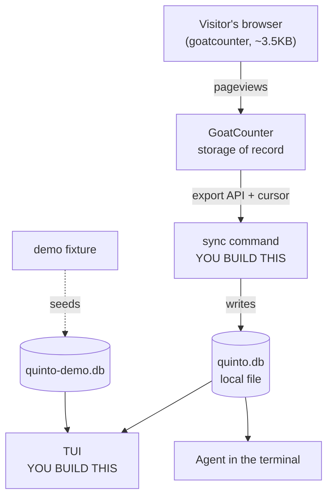

# quinto — Plan

*From "quinto sabor" — the fifth taste. Umami is the fifth taste, and Umami is the data source.*

**Status:** v1 shipped.
**Last updated:** 2026-07-26

> **What this document is.** The working decision log for quinto, kept as the
> project was built rather than written up afterwards. It records what was
> decided, what was rejected, and — more usefully — the several things that
> turned out to be wrong. Three data sources were evaluated and discarded before
> the fourth worked; the published API docs for the one we use were wrong in four
> places; two data-model errors only surfaced once realistic sample data existed.
>
> It is kept public because that trail is more informative than the code. If you
> only want to use quinto, the [README](README.md) is the whole story.

---

## What this is

A terminal-native web analytics dashboard for developers who already run agents in their terminal.

**Built as a craft project rather than a venture**, decided deliberately on 2026-07-24. The alternative was to spend several weeks validating demand first — interviews, segment research, the usual apparatus. That work would have delayed the build without changing a single decision in it, because the design constraints come from the data, not the market: at low traffic, aggregates are noise and only individual visits are honest.

So the scope was set by what makes a good tool for that constraint, and the validation was skipped on purpose. Naming the trade-off is the point; an unstated one tends to get discovered later as a flaw.

Jobs (Till's own framing):

- **Functional** — easy-to-read, *local* analytics
- **Emotional** — I can run it from my terminal
- **Social** — a specific aesthetic, for people already running agents in the terminal

---

## Definition of done

**Primary (verifiable):** merged into awesome-tuis → Dashboards.

**Real bar (what actually gets it noticed — the listing follows this, not the reverse):**

- [ ] A demo GIF in the README that works without explanation. This does more for a TUI than any feature.
- [ ] **A seeded demo dataset (`--demo` mode or checked-in fixture).** First-class deliverable, not an afterthought — see "The GIF problem" below.
- [ ] One hook that isn't "another pretty dashboard." Current candidate: the local data file is agent-queryable.
- [ ] Runs on someone else's machine in under a minute — single binary or one install command.
- [ ] A name worth typing.

### The GIF problem

Real traffic is single-digit humans and probably bot-dominated. A stream view showing six rows of `GET / — bot — 200` *is* the demo GIF, and it undersells the tool badly. It also means anyone who installs it sees an empty screen on first run.

So the demo dataset is not optional polish — it's what makes both the GIF and the first-run experience work. Build it early, from realistic shapes, and be transparent in the README that it's seed data.

Getting listed is a forcing function with a clean finish line. It is a weak quality signal on its own — the list accepts most working things. Build for the real bar; the listing follows.

---

## Resolved decisions

Output of a ten-round `/grill-me` session. Settled unless new evidence appears.

| # | Decision | Rationale |
|---|---|---|
| 1 | **"Local" = local database on the user's machine** | Events sync down; queries run against a local SQLite file. Not "UI is local, data lives in someone's cloud." |
| 2 | **Agent-readability is the hook** | A local file can be queried directly by an agent in the terminal — no API, no auth, no rate limits. Human TUI and agent read the same file. This is what separates it from every other dashboard on the list. |
| 3 | **Audience = devs running agents in the terminal** | Till's framing. Sharpest idea in the session. |
| 4 | **TUI, not a VS Code extension** | Editor-agnostic, works over SSH. Not "because people live in VS Code" — that argument points at an extension. |
| 5 | **Scroll depth is cut** | Marketer feature. Needs long content pages and per-page volume. Neither exists. |
| 6 | **Journey maps are cut** | Need ~500+ sessions/week to be anything but noise. Reframed to funnels, then cut too — a funnel at n=8 fails the same test. |
| 7 | **No custom collector, no self-hosting, no paying** | Do not build *or run* ingest infrastructure, and don't rent it either. ~~Cloudflare~~ → ~~Umami Cloud~~ → **GoatCounter** (see Phase 0 and the source decisions below). |
| 8 | **Streams, not aggregates** | Aggregates need volume. Streams don't. "Last 50 visits: what they hit, where from, what they did" is honest at any n, trivially a local table, and directly agent-queryable. |
| 9 | **Design for a traffic level the author doesn't have** | None of the author's sites produce enough traffic to stress-test the tool, so the design is driven by the low-volume case on purpose — and a realistic seeded dataset (ticket 02) does the work dogfooding would otherwise do. That ordering caught two data-model errors before the UI was written. |
| 10 | **"Local" = the read path, not the storage of record** | Events live in the vendor's cloud; the local SQLite file is a synced copy. TUI and agent read only the local file. |
| 11 | **Name: `quinto`** | From *quinto sabor*, the fifth taste — umami. Named after the *category* of taste, not the vendor, which is why it survived the source swap unscathed. Short, typeable, no vowel-dropping. |
| 12 | **Session-grouped stream view** | One row per visit, expandable to the path through the site. The honest small-n form of the customer journey map from the original brief. |

---

## Assumptions (flag if wrong)

- Biggest personal site shows **68 unique visitors / 24h** in Cloudflare, but **245 total requests** — 3.6 req/visitor, flat overnight, peaking at 4 AM. **Likely mostly bots.** Real human sessions probably single digits/day. ← *unverified*
- Low volume is now a **feature constraint, not a blocker** — it forces the stream design, which is the more interesting build anyway.
- ~~Cloudflare's GraphQL API exposes enough per-request detail~~ — **disproven 2026-07-24.** Enterprise only.
- ~~Umami Cloud's free tier is usable~~ — **disproven 2026-07-25.** API access is €20/month. Its data model was fine; the price wasn't.
- GoatCounter's export carries session IDs and a bot flag — **verified 2026-07-25** against their CSV export docs.
- GoatCounter stays free for this usage. ← *"currently offered for free for reasonable public usage" is their wording — not a contract. Accepted risk.*
- ~~GoatCounter does not auto-track SPA route changes, so every real session will be single-page~~ — **half wrong, corrected 2026-07-25 by real data.** The general point stands (GoatCounter counts one pageview per full load and has no automatic SPA hook), but tillvonkrueger.com already emits per-route pageviews *and* custom events. A real session came through as **5 hits across `/`, `/challenges`, `/process` plus two `Nav ·` events, 5s duration**. Multi-page sessions and `is_event = 1` both occur in real data. Ticket 02 stays a first-class deliverable for volume and the demo GIF — but not because the journey UI would otherwise be untestable.

---

## Approach

### Phase 0 — RESOLVED 2026-07-24 ❌ Cloudflare cannot be the source

**Question:** can Cloudflare give per-request rows (Decision 8's stream view) on a non-Enterprise plan?

**Answer: no.** Every route to raw request-level data is Enterprise-gated:

| Route | Free | Pro | Business | Enterprise |
|---|---|---|---|---|
| Logpush | ❌ | ❌ | ❌ | ✅ |
| Logpull (legacy) | ❌ | ❌ | ❌ | ✅ |
| Instant Logs | ❌ | ❌ | ❌ | ✅ |

*(Source: Cloudflare Logs docs, availability table, retrieved 2026-07-24.)*

The GraphQL Analytics API is no way around it. Its zone HTTP and RUM nodes are all `…Groups` — aggregated into dimension buckets by design. Raw (non-`Groups`) nodes exist only for a few products, not zone HTTP traffic. **There is no per-visit row anywhere on a free plan.**

Cloudflare Web Analytics *is* free on all plans, but it's the same story: aggregated RUM groups, no session-level stream.

**Consequence:** Decision 7 stands (still not writing a collector), Decision 8 stands (streams are still the right shape), but the **source changes**.

### Umami Cloud — ❌ RULED OUT 2026-07-25

**The free plan does not include API access.** An API key requires the paid tier at €20/month — €240/year, for a portfolio project, to read your own data. The API *is* the entire point of the integration, so the free plan is worthless here.

Self-hosting Umami would restore the API for nothing, but that call was already made and stands: **no self-hosting.** It was made when hosted was free, which weakens it — except the option below is free *and* hosted, so the trade never has to be made.

### The pattern behind three failed sources

Cloudflare gates raw request logs behind Enterprise. Umami gates the API behind €20/month. **This is not bad luck — raw per-event export is precisely the feature analytics vendors charge for.** Aggregates are cheap to serve and cheap to give away; individual rows are the product. Any future source has to be evaluated on this axis first, before anything else.

The exception is software that isn't monetised through hosting at all.

### Source decision — GoatCounter. Verified 2026-07-25.

Open source, donation-supported, **free hosted service** — *"currently offered for free for reasonable public usage. Running your personal website or small-to-medium business on it is fine."* API keys are created in the account with no paid gate.

**`POST /api/v0/export` returns a CSV of individual pageviews**, with exactly the fields this project needs:

| Field | Why it matters here |
|---|---|
| `Session` | Session ID — **the session-grouped stream view survives intact** |
| `FirstVisit` | Marks the session's first hit; gives you session boundaries for free |
| `Bot` | Explicit bot classification — **you can finally exclude the crawler noise** that made the Cloudflare numbers meaningless |
| `Path`, `Title`, `Event` | Path doubles as event name |
| `Browser`, `System`, `Screen size` | Client detail |
| `Referrer`, `Referrer scheme` | Scheme distinguishes link / generated / campaign / other |
| `Location` | ISO 3166-2 country code |
| `Date` | RFC 3339 |

**It's better than Umami would have been, on three counts:**

1. **Bulk export kills the N+1.** One request produces the whole dataset, gzipped. No per-session fan-out.
2. **`last_hit_id` is a cursor.** `POST /api/v0/export` accepts `start_from_hit_id`, so incremental sync is a native feature — you don't invent a watermark, you store their cursor.
3. **The `Bot` column** turns the project's biggest data-quality problem into a `WHERE` clause.

Also: ~3.5 KB script, no cookies, no GDPR notice required, and a JS-free pixel fallback.

⚠️ **Setup gotcha that will silently break everything:** the export requires **"Individual pageviews" enabled in site settings — it is off by default.** Without it there is no per-hit data and the whole design fails. Turn it on before anything else.

⚠️ **The export format is versioned** — the version number is the first field of the CSV header, and the docs strongly recommend erroring out if it changes rather than mis-parsing. Note also that GoatCounter's own docs say the **JSON export** is the better option for most people; check it before committing to CSV parsing.

⚠️ **Exports are rate limited to roughly one per hour.** Discovered by hitting the live API, 2026-07-25 — `{"error": "rate limited exceeded; try again in 59m44s"}`. This is *not* the documented 4 req/s general limit; it's a separate, far tighter budget on export creation.

**This shapes the product, not just the code.** `quinto sync` is a deliberate, infrequent action — it cannot be run on demand, and it cannot be run twice to check something. Consequences:

- The TUI should show **how old the data is** and **when the next sync is possible**. At a one-hour cadence, silently stale data is a lie the interface would be telling.
- A `429` is a normal operating state, not an error. Surface the retry window rather than a stack trace.
- Ticket 01's idempotency criterion is verified against fixtures, not by running two live syncs. You can't.

⚠️ **Use the CSV export, not JSON — despite GoatCounter's own docs recommending JSON.** From their OpenAPI spec: `start_from_hit_id` is *"Pagination cursor for CSV"*, while JSON only offers `start_from_day`. Hit-level resumption beats day-level, so CSV wins for incremental sync. Their advice is aimed at people doing one-off dumps.

⚠️ **`format` must be sent explicitly.** The spec says it defaults to CSV, but posting `{}` returns `{"error":"unknown format: \"\""}`. Send `{"format":"csv"}`.

⚠️ **Durability risk, stated plainly:** GoatCounter is one maintainer, donation-supported, and "currently free" is not a contract. That's a genuine risk — mitigated by the fact that the sync boundary makes swapping sources cheap. This is now the third source, and the architecture has absorbed all three without touching the TUI. That's evidence the boundary is in the right place.

### Sources evaluated — why not Plausible, Fathom, PostHog?

The requirement is narrow: **free, hosted, and raw per-visit rows with session identity.** Most analytics products fail the third one regardless of price.

| Source | Free? | Hosted? | Raw per-visit rows? | Verdict |
|---|---|---|---|---|
| **GoatCounter** | ✅ donation-supported | ✅ | ✅ export API, `Session` + `Bot` columns | **Chosen** |
| **PostHog Cloud** | ✅ generous free tier | ✅ | ✅ raw events via query API | Viable. Heavy bundle, consent surface, product-analytics complexity for a visit list. |
| **Plausible** | ❌ no free tier | ✅ | ❌ **aggregated only** | Ruled out — see below |
| **Fathom / Simple Analytics** | ❌ | ✅ | ❌ aggregated | Ruled out |
| **Umami Cloud** | ❌ API is €20/mo | ✅ | ✅ | Ruled out on price |
| **Cloudflare** | ✅ | ✅ | ❌ Enterprise only | Ruled out |

**Plausible deserves a specific note, because it's the obvious suggestion.** It is a better *product* than GoatCounter — nicer dashboard, more polish, a real company behind it. It is unusable *here*, for two independent reasons:

1. **The Stats API is a Business-plan feature** — not merely paid, but their upper tier.
2. **Even on that plan it's aggregated.** `/api/v2/query` takes `metrics` and `dimensions` and returns rollups. There is no per-visit row, so the session-grouped stream view — the whole product — cannot be built on it at any price.

Price is not why Plausible loses. **Shape is.** GoatCounter isn't the better analytics product; it's the one whose data-access model fits.

### Why not build the collector ourselves?

Reconsidered 2026-07-25 after three vendor failures — a legitimate prompt to revisit, not a settled question.

**The case for building it** is stronger than it looks: no fourth vendor to fail, "local" becomes literally true, total control of the schema (and the schema is the product), and at ten visits a day the collector is genuinely small. On Cloudflare Workers + D1 it's roughly a hundred lines with no server to maintain — *serverless is not self-hosting in the ops sense*, so the earlier "no self-hosting" call doesn't actually forbid it.

**The case against is distribution, and it decides it.** The definition of done is a stranger installing this in under a minute. With a vendor, anyone who already runs GoatCounter points `quinto` at it and has data immediately. With a bespoke collector, every user must first deploy *your backend* — which kills the install criterion, and with it the awesome-tuis pitch.

Secondary but real: bot classification is hard and GoatCounter gives it free — and bots are this project's single worst data-quality problem. Cookieless session identity (salted, daily-rotating hashes) is fiddly. GDPR posture becomes yours. And the two-weekend timebox does not survive any of it.

**Decision: GoatCounter for v1, and the question stays open rather than closed.** The sync boundary is the one thing that has survived three source swaps untouched, so `quinto collect` can be added later as another source behind the same interface, at near-zero cost to defer.

The honest reason not to build it first: most portfolio projects never reach v2. Spend the two weekends on the thing being judged.

**Sliced into tickets 2026-07-25** — see `.scratch/quinto-collect/issues/`. Six tickets: beacon-to-storage tracer, cookieless sessions, bot classification, abuse protection, export API with cursor, deploy story.

**The slicing is itself the argument.** The collector is six tickets against v1's six — *a second project the same size as the first*, and with more unknowns: bot classification accuracy, abuse handling on a public endpoint, and free-tier limits that have already killed three sources in this project. Two of the six (abuse protection, deploy story) produce no visible feature at all.

They're written as a separate effort deliberately. Two ways to use them:

- **As v2** — additive, behind the existing sync boundary. Ticket 05's success condition is that `quinto sync` swaps source with no change to the TUI, schema or query interface. That doubles as a test of whether the boundary is where this plan claims it is.
- **Instead of GoatCounter in v1** — then v1's ticket 01 is replaced by all six of these, the timebox roughly triples, and the under-a-minute install in ticket 06's definition of done breaks. Choose this only with that trade stated out loud.

### What this does to Decision 1 ("local")

The record of truth lives in GoatCounter; the local SQLite file is a **synced copy**. Worth being precise: **"local" describes the read path, not the storage of record.** The TUI and the agent both read the local file, never the API — which is what Decisions 1 and 2 actually depend on. Both survive intact.

## Architecture



**The TUI never talks to GoatCounter.** Only `sync` does. That single decision buys instant rendering, offline use, and — because the file is just a file — direct agent access with no API, auth, or rate limit in the way. It's also what makes Decision 2 real rather than a slogan, and it's why swapping the source three times has cost nothing downstream.

### What you actually build

Three things. Everything else is configuration.

| Piece | What it does |
|---|---|
| `sync` | GoatCounter export → SQLite. Incremental via their `last_hit_id` cursor, idempotent on hit ID. |
| TUI | Reads SQLite with SQL. Stream view first, overview second. |
| `query` subcommand | Runs raw SQL against the local file and prints it. **This is the agent interface** — an agent needs no database install and no schema hunting. |

### Local schema (draft)

The schema *is* the product — it's what the agent reads. Optimise it for legibility to something that has never seen the codebase.

GoatCounter's export is flat — one row per hit, with `session` grouping them. That's simpler than a two-table model and better for the agent interface, so keep it flat and derive sessions as a view:

```sql
hits(hit_id PK, session, path, title, is_event,
     browser, system, bot, referrer, referrer_scheme,
     screen_size, country, first_visit, created_at)

sessions  -- a VIEW over hits, grouped by session:
          -- first_seen, last_seen, page_count, entry_path,
          -- referrer, country, browser
```

Maps 1:1 onto GoatCounter's export columns — no translation layer, no invented vocabulary. `bot` stays in the table rather than being filtered at sync time, so the exclusion is visible and reversible rather than a silent data loss.

### The session model — four decisions (Till, 2026-07-25)

Everything the stream view can show comes from the `sessions` view, so these are load-bearing.

**1. The midnight split is accepted, not stitched.** GoatCounter's session hash rotates daily, so **a visit crossing midnight appears as two sessions.** This is a real artefact and will show up in the data. It isn't corrected, because stitching would mean guessing that two hashes belong to one person — precisely the inference GoatCounter's design refuses to make, and the reason it needs no consent banner. Document it in the README; don't quietly paper over it.

**2. The entry hit is whatever GoatCounter flags `first_visit = 1`** — not the earliest timestamp we happen to hold. Consequence: if a session's entry hit predates the first sync, `entry_path` and `referrer` are **NULL rather than wrong**. Self-correcting once that hit is synced, and a boundary artefact of the first sync only.

**3. Single-page visits have NULL duration, not 0.** You cannot observe when someone left, so `0` would assert something untrue. It also keeps aggregates honest: `AVG` skips NULL, so "average visit duration" means *the average of visits we could actually measure* rather than a number dragged toward zero by every unmeasurable one. At this traffic most visits are single-page, so this is not a cosmetic choice.

**4. Bots stay in the view.** Filtering there would make the exclusion invisible and permanent. Callers exclude with `WHERE bot = 0`, which the user can lift.

Each decision has a test asserting it in `internal/store/schema_test.go` — they're design commitments, not incidental behaviour.

### Setup sequence

1. Sign up at GoatCounter → you get `yourcode.goatcounter.com`
2. **Enable "Individual pageviews" in site settings.** ⚠️ Off by default. Without it there is no per-hit export and nothing below works.
   - **Save, then reload the page and confirm it's still ticked.** The toggle can appear flipped without persisting — this cost two export cycles on 2026-07-25 before we noticed.
   - **It is not retroactive.** Only hits recorded after it's on appear in exports. A dashboard full of pageviews means nothing; those are aggregates collected earlier.
   - Then **browse the site across several paths** before the first sync, or the export is empty and you have burned an hour of budget finding out.
3. Snippet into the site's `<head>` — data accumulates immediately:
   ```html
   <script data-goatcounter="https://yourcode.goatcounter.com/count"
           async src="//gc.zgo.at/count.js"></script>
   ```
4. Generate an **API key** (top menu → your username → API)
5. `quinto sync` → populates the local SQLite file
6. `quinto` → TUI reads the file
7. Agent: `quinto query "select path, count(*) from hits where bot = 0 group by 1"`

Steps 1–4 are an afternoon and require no code. The demo fixture writes the **same** schema to a separate file, so the TUI is identical whether it's showing real data or seed data — which is why it can be built before any real traffic arrives.

### Phase 1 — Build (the whole project)

**Timebox: 2 weekends to something demoable.** If it runs longer, the scope was wrong.

The work queue lives in **`.scratch/quinto-v1/issues/`** — six tracer-bullet tickets, each with its blocking edges. This section is the shape; the tickets are the detail.

| # | Ticket | Status |
|---|---|---|
| 01 | Sync one real visit from GoatCounter to the terminal | ✅ closed 2026-07-25 |
| 02 | Demo dataset | ✅ closed 2026-07-25 |
| 03 | Stream view TUI | ✅ closed 2026-07-25 |
| 04 | `quinto query` — the agent interface | ✅ closed 2026-07-25 |
| 05 | Overview / site health screen | ✅ closed 2026-07-25 |
| 06 | Ship | ⚠️ built; GIF + publish are Till's |

Shipped inside the two-weekend budget: `sync`, `demo`, `list`, `query`,
`schema`, `path`, and a two-screen TUI. Static binaries for macOS and Linux on
both architectures, built from one machine with no cgo.

Two ordering choices that aren't arbitrary: **02 precedes 03** so the TUI is designed against realistic density rather than six real rows, and **04 depends only on 01** so the agent interface can be built in parallel with the TUI.

Ticket 01 additionally carries the repo skeleton, and is gated on a human prerequisite — a GoatCounter account with individual pageviews enabled and an API key — not on another ticket.

**Testing policy:** test the sync logic, not the rendering. Idempotency, cursor handling and export-format version checking are claims you can't verify by eye. TUI output gets looked at, not asserted on. Two weekends is not a budget for more, and this is where tests actually pay.

**Demo vs real data:** `quinto demo` writes to a *separate database file* selected by a flag — not a source column in the shared schema. The schema is the agent interface and stays free of internal bookkeeping, and demo data can't clobber real data by construction.

### Cut from the plan

Netnography, interviews, kill criteria, segment validation. Right and necessary if the goal were a business; here they would have delayed the build without changing it, because the design follows from the data's shape rather than from what a market says it wants. Cut deliberately — restorable from git history if the goal ever changes.

---

## Rejected

| Rejected | Why |
|---|---|
| Own tracking script + ingest + event store | The TUI becomes step 5 of 5 and ~20% of the work. Not the point. |
| VS Code extension | Abandons Neovim/Zed/SSH users. |
| "For people in VS Code" positioning | Retrofitted rationale. |
| mctimey.app as dogfood target | No volume. |
| Scroll depth, journey maps, funnels | Wrong audience for a terminal; unbuildable at this volume. |
| Validating the segment before building | Would have delayed the build without changing it — the constraints come from the data, not the market. |

---

## Offen — bei Till

All six tickets are closed and v1 is published: repository live, `v0.1.0`
released with static binaries for macOS and Linux on both architectures, demo
GIF recorded, and the awesome-tuis listing submitted as
[PR #786](https://github.com/rothgar/awesome-tuis/pull/786).

Kept below for the record — what these items were, and why two of them were
never automated.

- [x] ~~**Record the demo GIF.**~~ Done — and it took two attempts: the first tape invoked `quinto` rather than `./quinto`, so every keystroke went to the shell and the GIF recorded an empty prompt.

  Original note: `brew install vhs && make demo-gif`, commit
      `docs/demo.gif`, then replace the placeholder comment at the top of the
      README with ``. Not done automatically because it
      installs vhs, ffmpeg and ttyd on your machine. **This is the single
      highest-leverage item left** — for a terminal tool the GIF is the entire
      first impression, and the awesome-tuis listing follows from it.
      Now also doubles as the **visual sign-off on the Charm v2 upgrade**: the
      tape needs no edits, but nobody has yet watched v2's renderer paint this
      app in a real terminal emulator. Unit tests cover the rendered strings;
      only the GIF covers what it looks like.
- [x] ~~**Publish.**~~ Done 2026-07-26.

  Original note: create the GitHub repo, push, cut a release with the
      binaries from `make release`, then open the PR against awesome-tuis under
      Dashboards. Outward-facing actions on your accounts.

Optional, unblocking nothing:

- [x] Your own pageviews reach GoatCounter fine — the earlier ad-blocker
      suspicion was wrong, confirmed by a real sync. Nothing to fix.
- [ ] Consider wiring `goatcounter.count()` into tillvonkrueger.com's router,
      so client-side navigation is recorded rather than only full loads.

---

## Notes

- Output of a `/grill-me` session, 2026-07-24. The plan changed substantially: audience changed, medium got an honest justification, the feature set inverted, "local" became an architecture, and and the project was reclassified from a product attempt to a deliberately unvalidated craft build.
- **Least evidenced decision:** number 2, agent-readability. It is the strongest differentiator on paper and the one with the least behind it — no user was observed wanting it. Treat it as a hypothesis the tool is testing, not a finding it rests on. The sharpest input in the session went the other way: the target segment, developers already running agents in their terminal, came from Till and reframed everything downstream.
